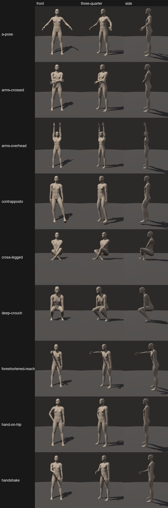
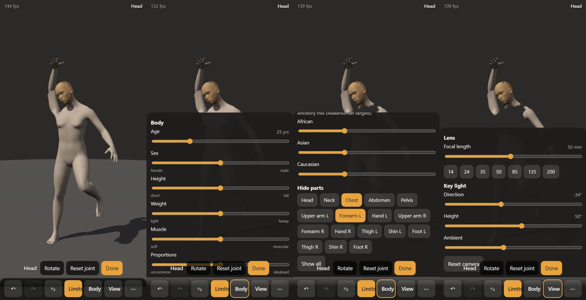
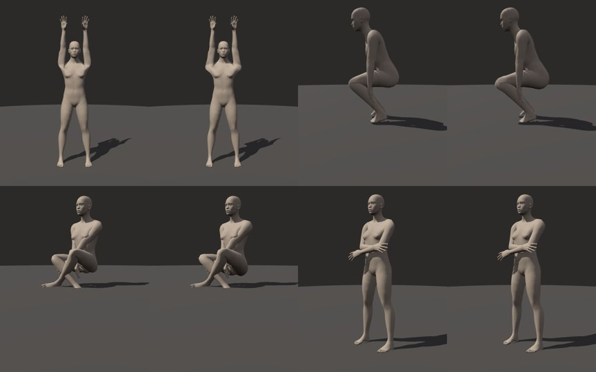

# M1 Mannequin — review

2026-10-07. **Live: https://mugasofer.github.io/lay-figure/** (installable; works offline after the first visit).

## Done-when checks

| Check | Status |
| --- | --- |
| All regression scenes render | ✅ 9 scenes × 3 cameras, below. The two-figure handshake is one figure until M4 brings multiple figures. |
| A pose survives save, load and URL round-trip exactly | ✅ Byte-identical scene after save → link → open in a fresh page → save again (browser test), and in unit tests. |
| 30 fps on your phone | ❓ **Needs you.** On this laptop (Intel UHD 630) it runs at 300–500 fps uncapped at phone and desktop sizes. |

## What's in it

- **Body:** MakeHuman's CC0 body. Sliders for sex, age (in years), height, weight, muscle, proportions, breast size and firmness, plus ancestry mix.
  - Shaped on the phone's own processor, with my own implementation of MakeHuman's macro maths, checked against MPFB.
  - Bones refit to every shape, so poses carry across bodies.
- **Posing:**
  - **Tap** a part to select it; it gets a soft highlight.
  - **Drag:**
    - Hands and feet pull the whole limb with IK, and keep their angle.
    - Forearms and shins bend the elbow or knee.
    - Upper arms, thighs and collarbones swing.
    - The head and chest turn their chains.
    - The hips move the body with the feet planted.
  - **Long-press**, or **Rotate**, gives rotation rings for any joint.
  - Joint **limits** are anatomical, with a switch to turn them off. There's also **mirror** (flip, or copy one side onto the other), **undo/redo** (toolbar or Ctrl+Z/Y) and **reset joint**.
- **Joints deform with CoR skinning**, the method approved in Phase 0. View → Skinning switches to classic linear blend if you want to compare.
- **Hide parts:** head, neck, chest, abdomen and pelvis, and each upper arm, forearm, hand, thigh, shin and foot.
- **Camera:** orbit, pinch-zoom and pan. Real focal lengths from 14 to 200 mm, with presets, and the framing holds when you change lens.
- **Light:** key light with adjustable direction and height, ambient light, shadow maps, ground plane.
- **Files:** save and load scenes as JSON, copy a share link (the whole scene compressed into the URL), reset pose.
- **Installable app** (PWA): the first load is about 2.8 MB, and after that it works offline.

*Front, three-quarter and side for each scene. Poses are authored with the app's own IK (`app/scripts/make-scenes.mjs`) and saved in `review/scenes/`.*

*Phone layout: selection bar, Body sheet, hidden parts, View sheet. The toolbar sits in thumb reach.*

*Each pair is classic linear blend (left) and CoR (right): overhead shoulders, deep crouch, cross-legged, arms crossed.*

## Please look at

1. **On the Note 9:** fps (top-left), and how posing feels compared with Spike C. Same gestures, but on the real body.
2. **The regression sheet.** Do these poses read right to you? I fixed the ones I could see were wrong; see the changelog.
3. **Body sliders at their extremes.** They're MakeHuman's own shapes, but you're the judge of whether they're useful for drawing.
4. **CoR vs classic skinning** in View → Skinning, on poses you care about.
5. **The UI:** button labels and placement, and the placeholder app icon (a stick figure I drew; you may want a better one).

## Known gaps and choices

- **No corrective shapes yet.** The Phase 0 plan was CoR plus corrective shapes generated automatically for each body. CoR is in; the correctives are next. Until then, the weak spots from Phase 0 remain: a slight armpit lump in a forward reach, the hard wrist bend, and the groin in deep hip flexion.
- **Hidden parts show the inside of the body,** because cut edges aren't capped yet. The brief schedules capping with the skeleton layer (M3).
- **No collision** until M4. Limbs can pass through the body. Dragging keeps the *target* out of the body, but the arm on its way there can still clip.
- **Fingers** are posed with rings only. Hand presets come in M3.
- **No separate "fat" slider.** MakeHuman's *weight* slider is mostly fat, with *muscle* separate. Per-region fat distribution (belly, hips, arms and so on) exists in MakeHuman's local modifiers and is the next body feature. Tell me if you want it sooner.
- **No twist bones.** CoR keeps forearm twist from collapsing (Phase 0). I'll add them if candy-wrapping shows up in use.
- **Age goes down to 1 year in SFW mode.** The brief clamps age only in adult mode, which doesn't exist yet.
- **S Pen:** pen input works as an ordinary pointer. Hover and the side button are untested on a working pen.

## Changelog

- Asset pipeline (`pipeline/lay_pipeline/`): reads MakeHuman's CC0 data directly. Macro sliders are fitted black-box to MPFB:
  - the default body matches exactly
  - single sliders are within 7 mm
  - random mixes are within a median of 5 mm
  - no GPL code or config is involved
- Body assets: 13,380-vertex body, 53-bone rig, CoR centres. Macro targets are deduplicated and packed by age, so the default load is about 2.8 MB.
- App:
  - CPU shaping, skeleton refit per shape, CoR skinning shader (with matching shadows and picking)
  - limits, IK, aiming, hips, rings, mirror, undo
  - GPU picking (about 1 ms, versus 40 ms for a raycast)
  - region hiding, save, load and share
  - PWA
- Unit tests (16): macro parity with Python, joint-limit maths, IK reach (random and anatomical targets), mirror, serialisation. They caught four real IK bugs:
  - the elbow hinge was taken from the wrong frame
  - elbow and knee limits were measured from the bent rest pose
  - the limits' flex direction disagreed with the solver's (hands couldn't reach the chest)
  - the shoulder limit pulled overhead reaches across the chest
- Bugs found in self-review and fixed:
  - bone rest frames were 90° off
  - chain aim over-rotated
  - picked bone ids were interpolated across triangles (tapping the pelvis selected the toes)
  - `.gz` assets were double-decompressed on some servers
