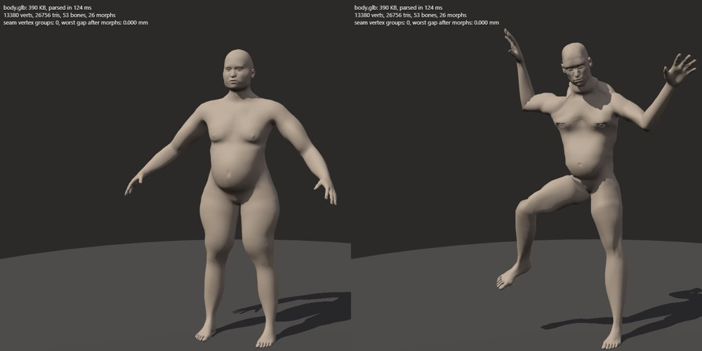
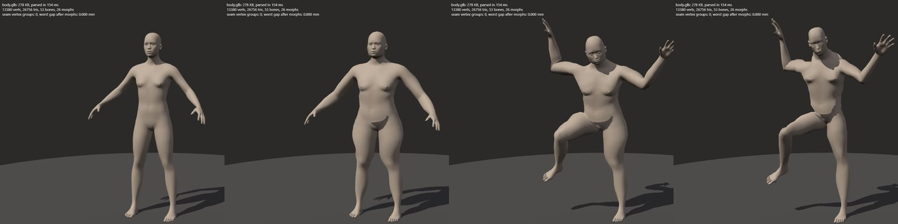
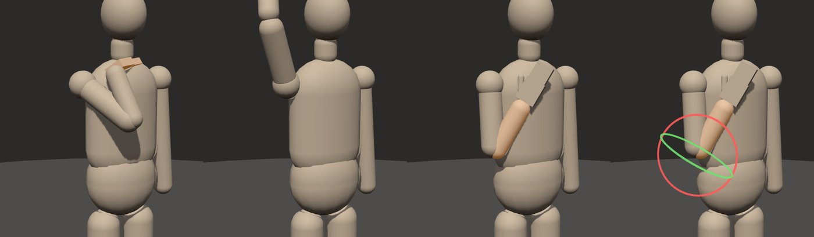
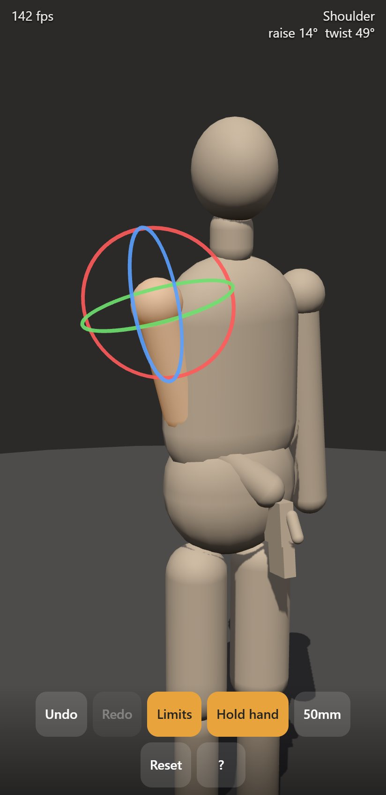

# Phase 0 report

2026-10-06. Three throwaway spikes, each answering one question from the brief. Recommendations are at the end of each section; what I need from you is collected at the bottom.

Live spikes: https://mugasofer.github.io/lay-figure/

---

## A. Base body: MakeHuman (via MPFB2) or Anny?

**The question turned out slightly mis-framed: they are the same body.** Anny's `base.obj` is MakeHuman's mesh, with the same targets and rigs. So the real choice is which *toolchain* to use.

| | MakeHuman data (via MPFB2) | Anny (NAVER) |
| --- | --- | --- |
| Licence | Assets CC0 1.0, [verified at source](https://github.com/makehumancommunity/makehuman/blob/master/LICENSE.md). MPFB2's code is GPLv3, but we never ship it. | Code Apache 2.0. The MakeHuman-derived data is CC0. NAVER's own additions are Apache 2.0. Its optional SMPL path downloads non-commercial data, which is banned by the brief anyway. |
| Mesh | 13,380 verts, all quads, decent joint loops | same |
| Rigs | `game_engine` 53 bones; `default` 163 (with split upper arm and forearm, usable as twist bones); `cmu_mb` 31 bones (matches CMU mocap, which helps M3) | its own 104-bone rig, with bone orientations stable across body shapes |
| Morphs | 592 local modifiers, plus macros (sex, age, weight, muscle, height, proportions, cup, firmness), plus pregnancy, face, etc. | same data, parameterised in PyTorch |
| Export | Blender, scriptable headless (done here) | no glTF/skin/morph exporter; needs PyTorch; API changes incompatibly between versions |
| Maintenance | 2.0.17 (Jul 2026), commits this week | 0.6.1 (Sep 2026) |

**Done-when checks.**

- A glTF with a 53-bone skeleton and 26 morph targets loads in Three.js.
- Stacking all morphs at once leaves **0.000 mm** gaps across 1,122 UV-seam vertex groups. That's measured in code, not eyeballed.
- Skinning plus morphs together pose correctly.
- **Size:** 1.6 MB raw. With meshopt compression plus gzip it's **193 KB**, or **275 KB** with morph normals. The whole first-load target is 25 MB.

*All local morphs at 1, and a male macro with muscle and pregnancy, posed. Shading is smooth.*

*The same without morph normals. Note the hard ledges on the belly and chest. Morph normals, or recomputing normals, are mandatory.*

**One real catch.** MakeHuman's macro sliders (sex, age, weight, muscle and so on) aren't independent morphs. They blend about 560 dense combination targets non-linearly, so exporting them as plain glTF morph targets would stack wrongly.

**Recommendation:**

1. Use the **CC0 MakeHuman data**, not Anny.
2. **Read the data files directly in our own pipeline** (`.obj`, `.target`, rig and weights JSON, all simple text formats) instead of calling MPFB2 code. This keeps GPL code out of our pipeline entirely, so the code-licence question stays open.
3. **Shape the body on the CPU, not with GPU morphs.** Port MakeHuman's macro maths to TypeScript and ship targets as compact sparse binaries, lazy-loaded. A slider change re-sums the active targets into the mesh and recomputes normals; at about 13k verts that's cheap even on the Note 9. This *is* the brief's "bake the body when shape editing ends", made the default. It also leaves the GPU's morph slots free for pose correctives (see B).
4. Build a custom rig: `game_engine` plus the upper-arm and forearm twist segments from `default`. Keep `cmu_mb` as a retargeting reference for M3.
5. Later, maybe: Anny's cleaned skinning weights (Apache 2.0, identical vertex order) are worth an A/B against MakeHuman's in M1.

Supplementary assets the research agent located (skeleton, muscle and genital meshes) are covered under licensing questions below. None is needed before M3.

---

## B. Joint deformation: LBS vs DQS vs correctives

Same body and rig (`game_engine`), rendered in Blender. Columns:

- **LBS:** linear blend skinning, what Three.js does by default.
- **DQS:** dual-quaternion skinning.
- **LBS+CS:** LBS followed by Corrective Smooth. This stands in for what an automatically generated corrective shape achieves, since the result can be baked into one.

Please look at these yourself; my read is below them.

My read:

| Joint | LBS | DQS | LBS+CS |
| --- | --- | --- | --- |
| Shoulder 170° | top of shoulder flattens, armpit stretches thin | keeps volume, but a lumpy bulge over the deltoid | cleanest, slightly soft |
| Elbow 145° | thin sharp fold at the point | rounder but puffy | cleanest |
| Wrist twist 90° | **candy-wrapper**: the wrist visibly narrows | holds width | holds width |
| Wrist flex −70° | harsh fold | same | same. **No skinning method fixes this.** It's a weights/helper-bone problem. |
| Hip 120° | front crease pinches | **thigh balloons** | cleanest |
| Knee 150° | back of knee collapses thin | **round lump** at the knee | cleanest |

**Recommendation:** keep LBS in the shader (it's cheap and standard), and fix it two ways:

1. **Twist bones** for the forearm and upper arm. That's the proper fix for candy-wrapping, and MakeHuman's `default` rig already has the segments.
2. **Pose-driven corrective shapes, generated automatically for the current body.** When shape editing ends, a Web Worker runs Corrective Smooth at a handful of key angles per joint and stores the results as rest-space deltas. At pose time each joint's angle drives its correctives, which are GPU morphs and cheap because only a few are active at once. They're body-specific without anyone hand-sculpting per body type. Hand-sculpted shapes stay available for the stubborn cases (wrist flexion, groin).
   - I benchmarked running Corrective Smooth live instead: about 40 ms per pose on the laptop, so roughly 150–250 ms on the Note 9. Fine on finger-lift, too slow mid-drag. Baking wins; running it on release is the fallback.
3. DQS: no. It trades collapse for bulges, and the bulges read worse in silhouette and line art.

**Question for you:** is LBS+CS's slight softness acceptable, given that it reads as "smoothed", or would you rather keep sharper anatomy and accept some LBS pinch? This is an art call.

---

## C. Touch posing

Prototype: https://mugasofer.github.io/lay-figure/spikes/c-touch/

**Controls:**

- Tap a part to select it. Drag it for IK.
- Long-press for rotation rings.
- One finger on empty space orbits; two fingers pinch and pan.
- S Pen: hover highlights parts; the side button orbits.
- The bottom toolbar has undo/redo, joint limits, "hold hand" and lens.

*Hand toward face, hand overhead, forearm drag, elbow rings.*

What I learned building it, before your phone test:

- **Depth is the core problem with touch IK.** A finger only gives 2D, so a drag happens in a plane facing the camera, and the first version kept putting the hand *inside* the chest. **Fix:** when the body surface is in front of the drag plane under your finger, the target moves to just in front of the body. The hand stays under your finger and lands on the near side. This already behaves like a soft version of M4's collision, and I'd keep it.
- **The elbow needs a will of its own.** Pure two-bone IK leaves the elbow's swivel undefined. My first version kept whatever swivel it had and flung the elbow sideways. **Fix:** keep the previous swivel, drift 15% per move toward a relaxed "down and slightly out" direction, and search for the nearest swivel that satisfies the joint limits and doesn't go through the torso.
- **Limits with swing/twist decomposition behave sensibly.** Shoulder swing is limited per direction (180° forward and outward, 60° back, 40° across the body), the elbow is a hinge plus forearm twist, and the wrist is a two-axis tilt. With "hold hand" on, the wrist hits its limits a lot, so the hand's twist is handed to the forearm, which is anatomically right.
- **Desktop Chrome runs it at 120–140 fps.** That tells us nothing about the Note 9; the real number has to come from your phone.

**I need your reactions on the phone:**

1. Does selection land where you mean?
2. Does your finger hide what you're posing?
3. Do the rings feel controllable?
4. Does the elbow go where you expect?
5. Is long-press the right gesture, and is 0.45 s the right delay?
6. Is "hold hand" the right default?
7. What fps does the top-left counter show?

---

## Proposed target revisions

- **First load:** propose **under 8 MB**, down from 25. The rigged body is about 0.3 MB, Three.js is about 0.7 MB, and targets lazy-load. 25 MB would invite bloat. Final call after M1.
- **30 fps with two figures on the Note 9:** unverified until your phone test of C. I'll add a two-body stress scene to the Spike A viewer if you'd like a number before M1.

## Licensing questions for you

These can wait; none blocks M1.

1. **Code licence:** still open. Reading MakeHuman data directly (recommendation A2) keeps GPL out, so MIT, Apache 2.0, GPL and anything else all remain possible.
2. **Adult pack genitals:** most community genital proxies are AGPL and therefore excluded.
   - One labelled CC0 describes itself as a remap of an AGPL asset. I'd exclude it.
   - Three other CC0-labelled ones don't state their origin.
   - The clean CC0 options are simplified only: wolgade's female proxies, "Simple penis", and the base mesh's own genital geometry with its six targets.
   - **No clearly clean CC0 asset gives anatomically complete female genitalia.** We'd probably have to sculpt our own; that's an after-M5 problem.
3. **Anatomy pack (Z-Anatomy, BodyParts3D):** both are CC BY-SA. Fitted bone and muscle meshes would stay BY-SA forever, as a separate pack, with credits. App code and the CC0 body are unaffected. OK?
4. **CT-derived skeleton on Sketchfab:** CC BY, but it carries a "NoAI" flag that conflicts with an AI-assisted pipeline. I propose excluding it.
5. **jwc's community "Skeleton" asset:** CC BY, and it claims a CC0 source that no longer exists online. Accept it on the uploader's word, or skip it?
6. **Anny's NAVER-authored data:** if we ever use it, I'd treat it as Apache 2.0 and credit NAVER, even where it sits in a folder labelled CC0.

## What I need from you to leave Phase 0

1. Your phone reactions to C (the seven questions above).
2. Your eye on B's sheets, and the LBS+CS softness question.
3. Go or no-go on A's recommendation: MakeHuman data, read directly, with CPU body shaping.
4. Whether the brief file should go into the public repo.
